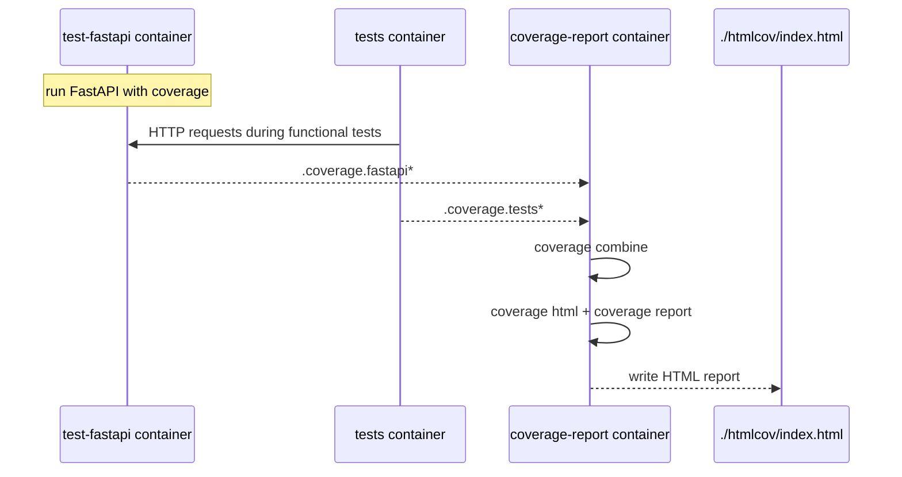
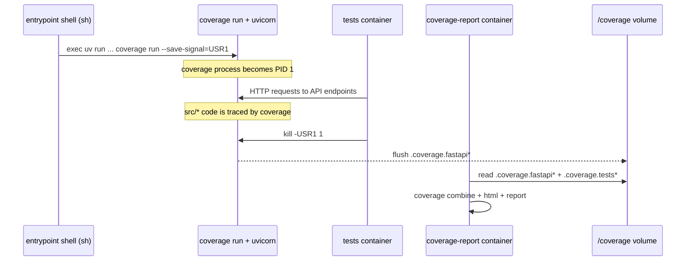

# Functional Tests with Coverage

## Why standard coverage methods are not enough

In this project, functional tests call the API over HTTP, while the application itself runs in a separate process/container. If you run only `coverage run pytest`, you mostly measure test code execution, not the FastAPI application code that handles requests.

To get meaningful coverage of `src/*`, we must:
- run FastAPI under coverage in its own container,
- run functional tests in a separate container,
- then combine coverage data from both processes.

This README describes that workflow.



## Setup

Functional tests run in Docker containers and collect coverage from both the application (FastAPI) and the tests.

## Run Tests with Coverage

```bash
cd tests/functional
make coverage-functional
```

After the tests complete:
- The coverage report will be available at `./htmlcov/index.html`
- Open `./htmlcov/index.html` in your browser

## How It Works

1. The **test-fastapi** container runs FastAPI via `coverage run`, saving data to `.coverage.fastapi*`
2. The **tests** container runs pytest via `coverage run`, saving data to `.coverage.tests*`
3. After tests finish, the data is merged with `coverage combine`
4. The HTML report is generated with `coverage html`

## Signal Flow (`exec` + `USR1`)



## Scripts Overview

Coverage workflow logic is split into small scripts in `./scripts`:

- `run_test_fastapi.sh` — starts FastAPI under coverage and enables flushing data via `USR1`
- `run_functional_tests.sh` — waits for dependencies and runs functional tests
- `generate_coverage_report.sh` — combines coverage files and generates HTML/text reports

This keeps `docker-compose.yml` shorter and easier to maintain.

## Cleanup

```bash
# Remove containers
docker compose down

# Remove coverage data
docker volume rm functional_coverage_data
rm -rf ./htmlcov
```