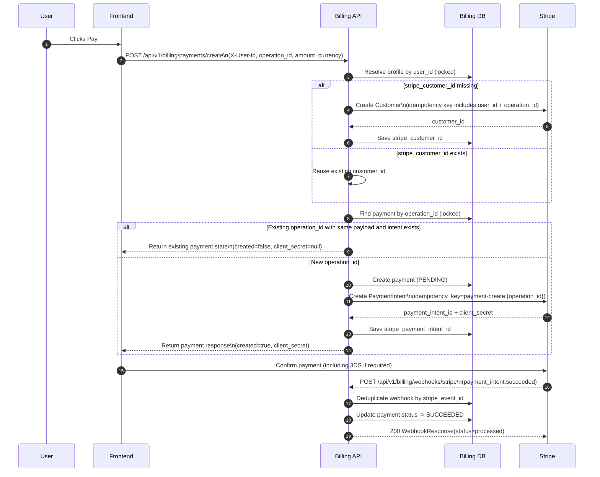
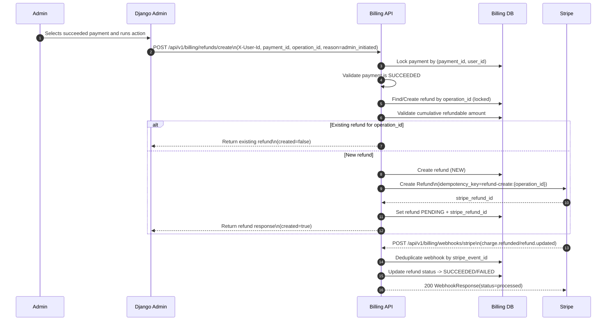
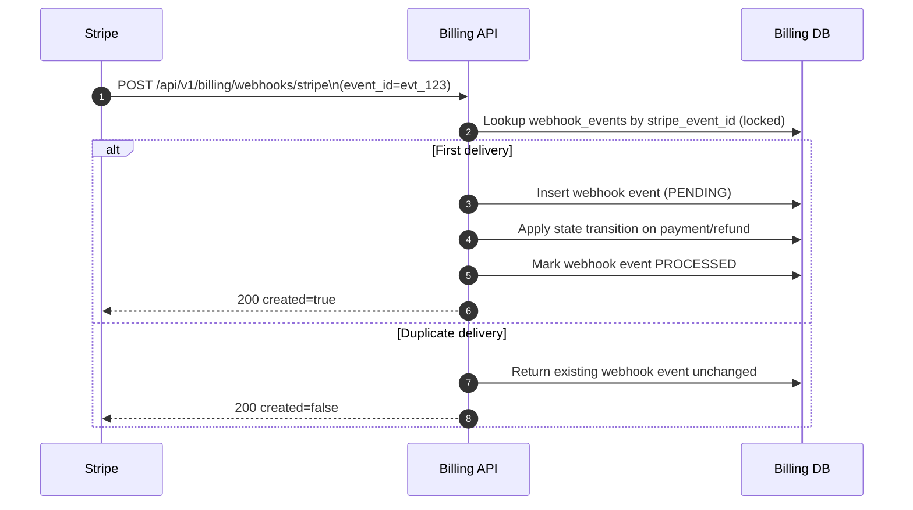

# Billing Service (FastAPI)

Standalone Stripe billing service for subscription payments and refunds.

## Goal

Provide a reliable billing workflow for subscriptions with:

- payment creation and status tracking;
- refund processing;
- protection from double charges and duplicate operations;
- clear, auditable states for users and support teams.

## Roles

- User: starts payment, sees status, can request refund via support flows.
- Admin: monitors payments/refunds and can initiate refunds from Django Admin.
- Stripe: payment processor and source of final payment/refund events.

## Solution Boundaries

- Stripe is the only payment provider.
- Stripe webhooks are the source of truth for final payment/refund outcomes.
- Internal business state is stored in our PostgreSQL billing schema.
- Stripe Customer is created lazily on first billing action.
- One user maps to one Stripe Customer (`user_id -> stripe_customer_id`).

## API

- Base path: `/api/v1/billing`
- Health: `/api/health`

Endpoints:

- `POST /payments/create`
- `GET /payments/{payment_id}`
- `POST /refunds/create`
- `POST /webhooks/stripe`

## Authentication Model

For service-to-service calls, user identity is passed via:

- `X-User-Id: <uuid>`

Webhook endpoint is public but protected by Stripe signature verification (`Stripe-Signature`).

## User Journeys

### UW-0: First billing action (lazy customer creation)

1. User starts first billing operation.
2. Service checks local `stripe_customer_id`.
3. If missing, service creates Stripe Customer and stores it.
4. Retries/double clicks do not create duplicate customers.

Expected result:

- user has one stable `stripe_customer_id`;
- all future payments/refunds use the same Stripe customer.

### UW-1: Successful subscription purchase

1. User clicks Pay.
2. Service ensures Stripe Customer exists.
3. Service creates local payment and Stripe PaymentIntent.
4. User confirms payment (including 3DS when needed).
5. Stripe sends `payment_intent.succeeded` webhook.
6. Service marks payment as `SUCCEEDED`.

Expected result:

- one successful charge;
- payment status is consistent and visible in history.

### UW-2: Failed payment

1. User starts payment.
2. Payment fails (bank/3DS failure).
3. Stripe sends failure webhook.
4. Service marks payment `FAILED`.

Expected result:

- no false success state;
- clear next step for retry.

### UW-3: Repeated Pay click / retried request

1. Same operation is submitted multiple times.
2. Service receives same `operation_id`.
3. Service returns existing operation state instead of creating a new charge.

Expected result:

- no duplicate charge;
- idempotent response.

### UW-4: Network loss during payment

1. User confirms payment but client loses response.
2. Stripe still sends webhook.
3. Service updates local state from webhook.

Expected result:

- final state is recovered without manual repair.

### UW-5: Refund via admin flow

1. Admin opens payment and starts refund.
2. Service creates Stripe refund request.
3. Stripe sends refund webhook (`charge.refunded` / `refund.updated`).
4. Service marks refund final status.

Expected result:

- refund is traceable;
- status is visible for support/admin.

### UW-6: Duplicate Stripe webhook delivery

1. Stripe sends same event more than once.
2. Service deduplicates by Stripe event ID.

Expected result:

- no repeated state transitions.

## Sequence Diagrams (Updated)

### SD-1: Successful payment with lazy customer creation



### SD-2: Refund initiated from Django Admin



### SD-3: Duplicate webhook handling (idempotent processing)



## Status Model

Payment statuses:

- `NEW`
- `PENDING`
- `SUCCEEDED`
- `FAILED`
- `CANCELED`

Refund statuses:

- `NEW`
- `PENDING`
- `SUCCEEDED`
- `FAILED`

## Non-Functional Requirements

- Idempotency for payment/refund create operations.
- Consistency: final statuses are confirmed by Stripe webhooks.
- Observability: logs include operation and Stripe correlation IDs.
- Auditability: status transitions and admin actions are persisted.
- Stable identity mapping: one user to one Stripe customer.

## Edge Cases and Test Focus

High-priority scenarios covered by tests include:

- duplicate payment creation attempts;
- duplicate webhook delivery;
- invalid webhook signature;
- first-time customer creation;
- repeated refund request idempotency;
- Stripe temporary failures during refund.

## Data Model and Migrations

- Alembic is local to this service.
- Migration `0001_initial_billing` creates schema and tables:
  - `billing_profiles`
  - `payments`
  - `refunds`
  - `webhook_events`

## Environment

Copy `.env.example` to `.env` and set values.

Required:

- `POSTGRES_DB`
- `POSTGRES_USER`
- `POSTGRES_PASSWORD`
- `SQL_HOST`
- `SQL_PORT`
- `STRIPE_SECRET_KEY`
- `STRIPE_WEBHOOK_SECRET`

Optional:

- `POSTGRES_DB_SCHEMA` (default: `billing`)
- `DEVELOPMENT_MODE`
- `CORS_ORIGINS`
- `SQL_ECHO`

## Run Locally

```bash
cd billing
uv sync
uv run alembic upgrade head
uv run uvicorn src.main:app --host 0.0.0.0 --port 8010
```

## Design Guarantees

- operation-level idempotency for payment and refund creation;
- race-safe profile/payment/refund writes using DB locks and constraints;
- safe retry behavior for transient Stripe failures;
- webhook deduplication and protection from invalid state downgrades.
